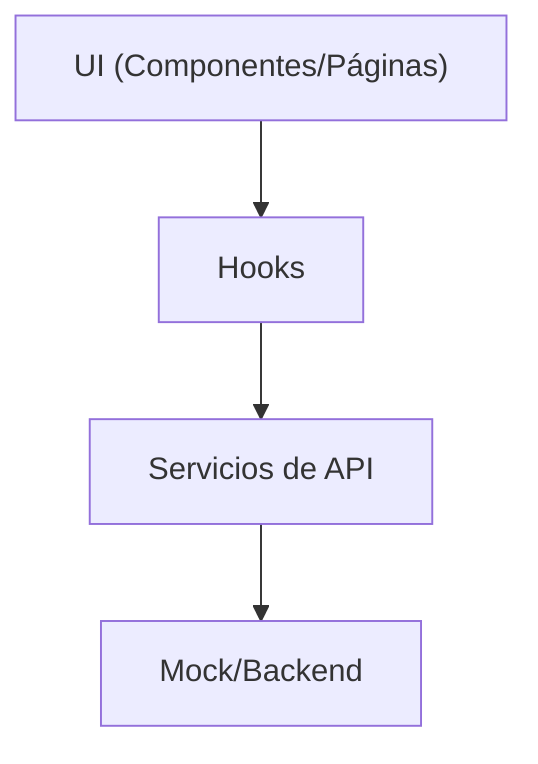

# Arquitectura de Software — Software Dashboard

## Visión General

Este proyecto implementa un dashboard empresarial modular, escalable y mantenible, siguiendo principios de arquitectura moderna (2025), feature-based y domain-driven design (DDD). El objetivo es facilitar la gestión de incidencias, requerimientos, usuarios, reportes y métricas en una organización.

---

## Estructura de Carpetas

```
src/
  app/                # Infraestructura de la app (rutas, entry points)
  features/           # Lógica de negocio por dominio (incidents, requirements, users, etc.)
  shared/             # Recursos compartidos (servicios, hooks, tipos, utilidades, componentes UI)
    services/
      api/            # APIs modulares por dominio (authApi, incidentsApi, etc.)
    utils/            # Utilidades generales
    types/            # Tipos TypeScript compartidos
    context/          # Contextos globales (ej. configuración)
    hooks/            # Hooks compartidos
    components/       # Componentes UI y layout compartidos
```

---

## Principios y Patrones

- **Feature-based**: Cada dominio tiene su propio espacio para hooks, componentes, páginas, servicios y tipos.
- **Barrel Exports**: Uso de `index.ts` para simplificar imports y mantener el código limpio.
- **SOLID**: Cada archivo cumple una única responsabilidad.
- **Lazy Loading**: Las páginas se cargan bajo demanda para optimizar el performance.
- **Desacoplamiento**: Los servicios de API no dependen de la UI ni de hooks.
- **TypeScript**: Tipado estricto en todo el proyecto.

---

## Flujo de Datos

1. **UI (Componentes/Páginas)** → 2. **Hooks** → 3. **Servicios de API** → 4. **Mock/Backend**
   - Los hooks gestionan el estado y llaman a los servicios.
   - Los servicios de API abstraen la comunicación y pueden migrar fácilmente a un backend real.

---

## Extensibilidad

- **Nuevo feature**: Crear carpeta en `features/` con subcarpetas `components/`, `hooks/`, `pages/`, `services/`, `types/`, `utils/`.
- **Nuevo servicio de API**: Crear archivo en `shared/services/api/` y exportar desde el barrel.
- **Migrar a backend real**: Reemplazar la lógica mock en los servicios de API por llamadas HTTP reales.

---

## Testing y Calidad

- Los tests deben ubicarse junto a los features o en una carpeta `__tests__`.
- Se recomienda usar Jest, React Testing Library y mocks para servicios.
- Linter y Prettier deben estar configurados para mantener la calidad y consistencia.
- Se recomienda usar Husky para hooks de pre-commit.

---

## Seguridad

- Los servicios de autenticación deben migrar a un backend seguro en producción.
- Los tokens y datos sensibles deben manejarse con cuidado y nunca almacenarse en texto plano.
- Usar HTTPS y políticas de CORS estrictas en producción.

---

## Convenciones

- **Nombres**: `useXxx` para hooks, `XxxApi` para servicios, `XxxPage` para páginas.
- **Imports**: Siempre usar barrel exports cuando sea posible.
- **Componentes**: Usar funciones y React.FC, nunca clases.
- **Carpetas**: Minúsculas y en inglés.

---

## Diagramas



---

## Ejemplo de Extensión

**Agregar un nuevo feature "notifications":**
1. Crear carpeta `src/features/notifications/` con subcarpetas `components/`, `hooks/`, `pages/`, `services/`, `types/`, `utils/`.
2. Crear el servicio `notificationsApi.ts` en `shared/services/api/notifications/`.
3. Exportar el servicio en el barrel `shared/services/api/index.ts`.
4. Crear hooks y componentes específicos en el feature.
5. Agregar la ruta en el sistema de rutas.

---

## Mantenimiento y Buenas Prácticas

- Mantener la documentación actualizada con cada cambio arquitectónico relevante.
- Usar comentarios descriptivos en los archivos clave.
- Revisar y mejorar la accesibilidad (a11y) en los componentes UI.
- Realizar code reviews y testing continuo.

---

## Contacto y Colaboración

Para dudas, sugerencias o contribuciones, contactar al equipo de arquitectura o revisar las guidelines internas del repositorio. 